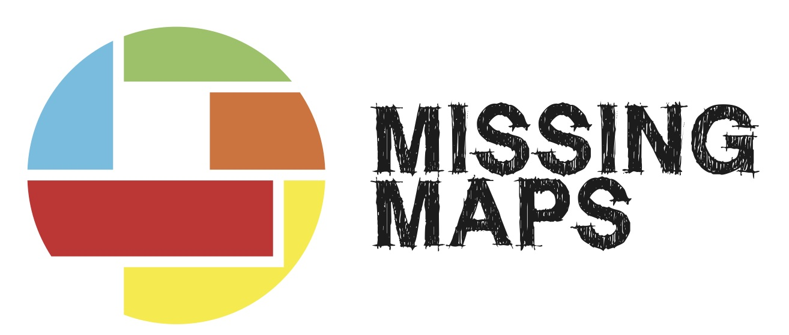
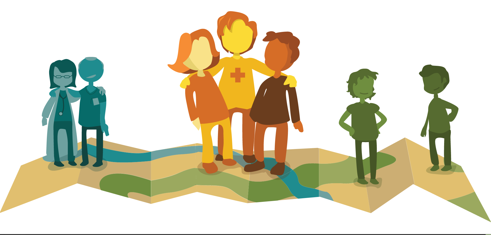

# Missing Maps Mapathon & Validation Session

## Putting the World's Vulnerable People on the Map.

Each year, disasters around the world kill nearly 100,000 and affect or displace 200 million people. Many of the places where these disasters occur are literally 'missing' from any map and first responders lack the information to make valuable decisions regarding relief efforts. Missing Maps is an open, collaborative project in which you can help to map areas where humanitarian organisations are trying to meet the needs of vulnerable people.

## Beginners

For the beginners we will have a Mapathon.

Interesting links/tutorials: 

* http://learnosm.org/en/beginner/id-editor/
* http://www.missingmaps.org/contribute/#learn
* http://learnosm.org/en/beginner/introduction/

## Experienced

The experienced mappers can work on Validation.

Interesting links/tutorials: 

* https://wiki.openstreetmap.org/wiki/OSM_Tasking_Manager/Validating_data
* https://josm.openstreetmap.de/
* http://learnosm.org/en/josm/

### Detailed Program

**18:30** Maptime starts, De Waag, Nieuwmarkt 4. Open up your laptops 

**18:45**  Introdcution by Koos Krijnders - Red Cross volunteer Missing Maps

**19:15** Split into two groups:

   Beginners group - Mapping with the iD editor.

   Experienced group -- Validation session

**19:30** Explanation per group

**20:00** Mapathon & Validation Session

Maptime is **BYOB** (and food). Tea and coffee is provided, but you're welcome to bring your own beer, drinks, snacks or dinner to the Waag.

